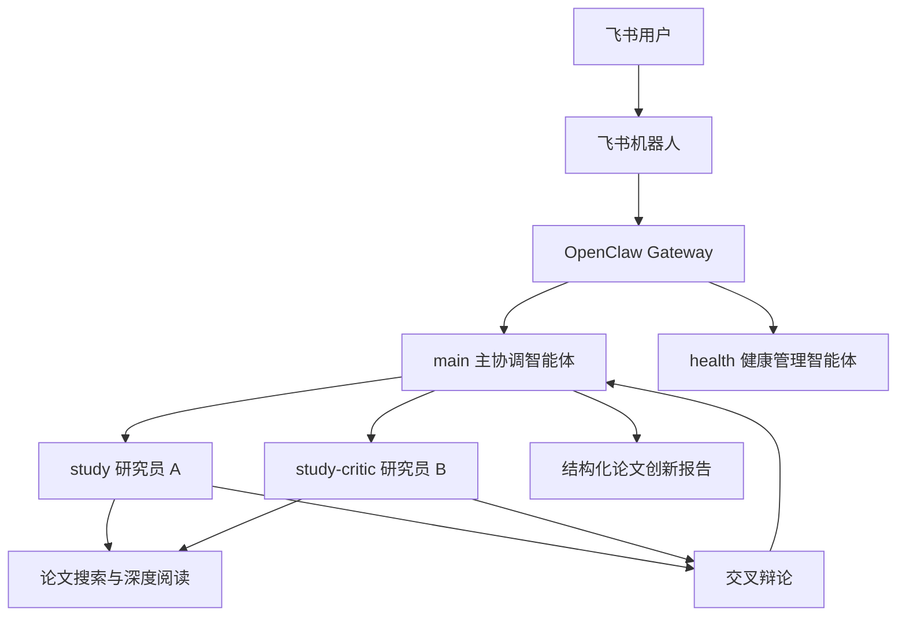

# 智研擂台

基于 OpenClaw、飞书和 StepFun 的多智能体论文创新辩论系统。

## 项目简介

智研擂台面向论文调研、科研选题和创新点验证场景。系统使用一个主协调智能体和两个相互独立的研究智能体完成“独立检索—提出方案—交叉质疑—统一评审”的工作流，减少单一模型思路单一、缺少反证和把已有方法误判为创新点的问题。

用户可以在飞书中提出研究任务，例如：

> 调研近两年的 VLA 与具身世界模型论文，提出三个可验证的创新点，让两名研究员辩论后给出最终方案。

主智能体负责拆解任务、控制研究阶段和汇总结果；研究员 A 与研究员 B 在独立上下文中检索论文并提出方案，之后针对新颖性、可行性、算力成本、数据需求和实验风险进行交叉评审。最终输出包括研究问题、核心假设、技术路线、最近相关工作、基线、消融实验、失败条件和预期贡献。

### 应用场景与市场需求

现有科研辅助产品多集中于论文摘要、问答、翻译和润色，而决定科研质量的“创新点论证”仍高度依赖人工。智研擂台把真实科研协作中的独立思考、竞争方案、交叉质疑、答辩修正和主持综合转化为可执行流程，可用于开题论证、组会预演、论文创新点推演、基金方案预审和企业技术路线评估。项目当前重点服务于 VLA、具身智能和世界模型，后续可扩展到专利分析、医疗研究、教育和工业研发。

## 核心功能

- 飞书多机器人接入与 Agent 路由。
- OpenClaw 多智能体任务编排。
- StepFun Step 3.7 Flash 长上下文推理。
- Semantic Scholar 学术论文检索。
- 两名研究员独立研究与多轮辩论。
- 主智能体结构化评审和方案融合。
- 健康与饮食记录 Agent 扩展示例。
- Windows 桌面任务完成通知插件。
- 可选的向量记忆和知识图谱记忆扩展。

## 系统架构



## Agent 角色

| Agent | 飞书账号示例 | 职责 |
|---|---|---|
| `main` | `main` | 任务拆分、流程控制、辩论主持和最终评审 |
| `study` | `study` | 独立检索论文、发现缺口、提出创新方案 |
| `study-critic` | `study2` | 独立研究、最近工作审计、反驳和风险分析 |
| `health` | `health` | 饮食记录与健康信息整理扩展示例 |

角色提示词位于 [`agents`](agents)；多智能体论文评审流程位于 [`skills/paper-debate-review`](skills/paper-debate-review)。

## 目录结构

```text
.
├─ agents/                         # 四个 Agent 的公开角色配置
├─ config/openclaw.example.json    # 不含密钥的配置模板
├─ docs/                           # 项目、部署和安全说明
├─ plugins/desktop-notify-tools/   # Windows 桌面通知插件
├─ scripts/                        # 论文搜索与安全检查脚本
└─ skills/paper-debate-review/     # 多智能体论文辩论技能
```

## 快速部署

### 1. 环境要求

- Windows 10/11
- Node.js：满足当前 OpenClaw 版本要求
- Python 3.10+
- OpenClaw 2026.7.1 或兼容版本
- StepFun API 或 Step Plan 账号
- 至少一个飞书企业自建应用

### 2. 安装 OpenClaw 与 Provider

```powershell
npm install -g openclaw
openclaw plugins install @openclaw/stepfun-provider
```

按照 OpenClaw 向导配置 StepFun 凭据，模型选择：

```text
stepfun-plan/step-3.7-flash
```

### 3. 创建 Agent

```powershell
openclaw agents add health
openclaw agents add study
openclaw agents add study-critic
```

将 `agents/<agent-id>/AGENTS.md` 复制到对应工作区，并根据本机用户名修改 [`config/openclaw.example.json`](config/openclaw.example.json) 中的路径与占位符。

### 4. 配置飞书

在飞书开放平台分别创建机器人应用，启用机器人能力和事件长连接，将各应用的 App ID、App Secret 填入本地 `openclaw.json`。不要把真实密钥提交到 Git。

路由关系示例：

```text
飞书 main   -> Agent main
飞书 health -> Agent health
飞书 study  -> Agent study
飞书 study2 -> Agent study-critic
```

### 5. 启动

```powershell
openclaw gateway restart
openclaw status
```

完整步骤见 [`docs/DEPLOYMENT.md`](docs/DEPLOYMENT.md)。

如需在DGX Spark上完全本地运行StepFun模型，请参阅：

- [`DGX Spark部署Step-3.7-Flash-GGUF与OpenClaw多智能体`](docs/DGX_SPARK_STEP37_GGUF_DEPLOYMENT.md)

## 本地算力与 NVIDIA 规划

当前版本使用本地计算机运行 OpenClaw Gateway、Agent 工作区、技能、论文解析、消息路由和记忆服务，复杂模型推理由 StepFun Step 3.7 Flash 完成。

项目设备具备 NVIDIA GeForce RTX 5060 Laptop GPU，但本仓库当前尚未集成 CUDA Toolkit、TensorRT-LLM、NVIDIA NIM 或 Nemotron 模型。后续计划使用量化后的 4B 级 NVIDIA 模型承担本地摘要、分类、向量化和候选论文重排序，以形成“本地轻量计算 + 云端复杂推理”的混合架构。项目申报时应将这些 NVIDIA 能力标记为后续集成方案，完成实际代码和性能测试后再改为已实现。

DGX Spark 可作为项目后续的桌面 AI 计算平台：将未公开论文、初步实验结果和专利前方案的预处理、向量化、相关性排序与轻量摘要尽量留在实验室本地，仅把筛选后的必要上下文交给复杂推理模型。在真实硬件与SDK集成完成后，可进一步评估 NVIDIA NIM、TensorRT-LLM 或 NeMo Agent Toolkit在服务标准化、工作流分析和推理性能方面的价值。

## 安全说明

本仓库是从 OpenClaw 运行目录提取的脱敏版本，明确排除了：

- 飞书 App Secret、模型密钥和 Gateway Token。
- `credentials`、`identity` 和 `devices`。
- 对话历史、用户长期记忆和向量数据库。
- 日志、媒体文件、备份和临时截图。
- `node_modules`、缓存、构建产物和本机绝对路径。

提交前运行：

```powershell
powershell -ExecutionPolicy Bypass -File scripts/security-scan.ps1
```

## 项目状态

- [x] OpenClaw 多 Agent 配置
- [x] 飞书多机器人路由
- [x] StepFun Step 3.7 Flash 接入
- [x] 论文检索与对抗式研究流程
- [x] Windows 桌面通知插件
- [ ] NVIDIA CUDA/TensorRT-LLM/NIM 实际集成
- [ ] 本地 Nemotron 模型量化与性能测试
- [ ] 论文引用自动核验与可视化辩论界面

## 许可证与第三方组件

OpenClaw、StepFun Provider、外部 Skills 和第三方服务遵循各自许可证与使用条款。本仓库不重复分发已安装的第三方插件源码，只保存项目自身配置、角色和自定义代码。
